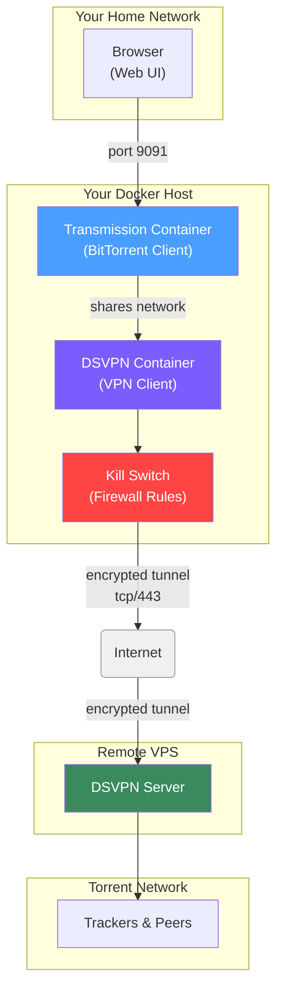

# Download Torrents Privately with a VPN Kill Switch (DSVPN + Transmission)

## What is This?

A simple Docker setup that runs a **BitTorrent client** (Transmission) inside a **VPN tunnel** with a **kill switch**. If the VPN drops, all internet traffic stops — your real IP address is never exposed.

## Why Would You Want This?

When you download a torrent, your IP address is visible to everyone in the swarm. That means your internet provider, copyright trolls, and anyone monitoring can see exactly what you're doing. By routing all torrent traffic through a VPN:

- Your real IP stays hidden
- Your ISP only sees encrypted traffic to the VPN server
- If the VPN disconnects, the kill switch cuts all traffic immediately

## How It Works



**The flow:**

1. **Transmission** (the torrent client) has **no network of its own** — it borrows the DSVPN container's network
2. **DSVPN** creates an encrypted tunnel **over the internet** to a cheap VPS somewhere else in the world
3. **The Kill Switch** is a set of firewall rules that:
   - Block **all** traffic by default
   - Only allow traffic going through the VPN tunnel (`tun0`)
   - Only allow the initial connection to the VPN server itself
4. **You** access the nice web UI at `http://your-server:9091`

## What You'll Need

- A Linux machine (or any machine that runs Docker — a Raspberry Pi, an old PC, a VPS, etc.)
- Docker and Docker Compose installed
- A cheap VPS (virtual server) somewhere — any provider works for \$3-6/month
- Basic comfort with the terminal

## Step-by-Step Setup

### Step 1: Set Up the VPN Server

This project uses [DSVPN (Dead Simple VPN)](https://github.com/jedisct1/dsvpn) — it's lightweight, fast, and runs on any Linux server.

On your **VPS**, run:

```bash
# Download and compile DSVPN server
git clone https://github.com/jedisct1/dsvpn.git
cd dsvpn
make
cp dsvpn /usr/local/bin/

# Generate a key (keep this safe!)
dd if=/dev/urandom of=/etc/dsvpn.key count=1 bs=32

# Start the server (runs in the foreground)
dsvpn server /etc/dsvpn.key auto 443
```

Leave that running. Your VPS is now listening on port 443 for VPN connections.

> **Port note**: Port 443 is used here because it is rarely blocked by firewalls. Note that DSVPN is not TLS — it uses its own protocol, so traffic is not indistinguishable from HTTPS to a deep-packet inspector.

To make it permanent, install the systemd unit:

```ini
# /etc/systemd/system/dsvpn.service
[Unit]
Description=Dead Simple VPN - Server

[Service]
ExecStart=/usr/local/bin/dsvpn server /etc/dsvpn.key auto 443 auto 10.8.0.254 10.8.0.2
Restart=always
RestartSec=20

[Install]
WantedBy=network.target
```

```bash
systemctl enable dsvpn.service
systemctl start dsvpn.service
```

### Step 2: Clone This Project on Your Docker Machine

```bash
git clone <this-repo-url> dsvpn-transmission
cd dsvpn-transmission
```

### Step 3: Copy the VPN Key

DSVPN uses symmetric-key cryptography — both machines use the same key file. Copy it from your VPS to your local machine:

```bash
scp root@your-vps-ip:/etc/dsvpn.key ./dsvpn.key
```

For an easy copy-paste across machines, use base64:

```bash
# On the VPS
cat /etc/dsvpn.key | base64
# Outputs something like: ZqMa31qBLrfjjNUfhGj8ADgzmo8+FqlyTNJPBzk/x4k=

# On the Docker host
echo 'ZqMa31qBLrfjjNUfhGj8ADgzmo8+FqlyTNJPBzk/x4k=' | base64 -d > dsvpn.key
```

### Step 4: Edit the Configuration

Copy the environment file from the template and open it:

```bash
cp dsvpn.env.example dsvpn.env
nano dsvpn.env
```

Set your VPS IP and choose a username/password for the web UI:

```bash
DSVPN_SERVER=your-vps-ip          # <-- change this
DSVPN_PORT=443

DNS_SERVER=88.198.92.222          # change only if you use a different DNS

PUID=1000                         # match your host user's ID (run id -u)
PGID=1000                         # match your host group's ID (run id -g)
TZ=Etc/UTC                        # your timezone, e.g. Europe/Athens

USER=your-username                # <-- pick a username
PASS=your-strong-password         # <-- pick a strong password
```

That's it — every setting lives in one file now.

### Step 5: Start Everything

```bash
docker compose up -d --build
```

This will:
1. Build the DSVPN client container (compiles the VPN client from source)
2. Pull the Transmission container
3. Start both services
4. The kill switch activates automatically

### Step 6: Access the Web UI

Open your browser and go to:

```
http://your-docker-host-ip:9091
```

Log in with the username and password you set in Step 4.

## How to Verify It's Working

### 1. Check the VPN tunnel is up

```bash
docker compose exec dsvpn ip link show tun0
```

If you see `tun0` with `state UP`, the tunnel is working.

### 2. Check your IP is hidden

Open the Transmission web UI, add any public torrent, and look at the tracker status. Or use a check-my-IP torrent — your public IP should show the VPN server's IP, not yours.

### 3. Test the kill switch

The kill switch is already active. To verify:

```bash
# Check IPv4 firewall rules
docker compose exec dsvpn iptables -L -n

# Check IPv6 firewall rules
docker compose exec dsvpn ip6tables -L -n
```

Both IPv4 and IPv6 default output policies are `DROP` — traffic is only allowed through the tunnel or to the VPN server directly. IPv6 is blocked entirely since DSVPN only creates an IPv4 tunnel.

## File Layout

```
.
├── docker-compose.yml              # DSVPN client service
├── transmission-docker-compose.yml # Transmission service (included)
├── Dockerfile                      # Builds dsvpn client from source
├── entrypoint.sh                   # Sets up kill switch + starts VPN
├── autostart.sh                    # Convenience: rebuild + restart
├── dsvpn.env                       # Your settings (not tracked in git)
├── dsvpn.env.example               # Template for the env file
├── dsvpn.key                       # Symmetric key (not tracked in git)
└── transmission/
    └── config/
        └── ...                     # Runtime data (gitignored — managed by Transmission)
```

## Troubleshooting

| Problem | Likely Fix |
|---------|-----------|
| `tun0` not found | Check your VPS DSVPN server is running and the key matches |
| DNS not resolving | Check `cat /etc/resolv.conf` inside the container — should show your DNS server |
| Can't reach web UI | Check port 9091 is not blocked by your own firewall |
| Kill switch blocking everything | Restart the container: `docker compose restart dsvpn` |

## The Commands Cheat Sheet

```bash
# View logs
docker compose logs -f dsvpn
docker compose logs -f transmission

# Restart everything
docker compose down && docker compose up -d

# Stop everything
docker compose down

# Rebuild and restart (after changing config)
docker compose up -d --build
```

## Why DSVPN and Not Regular VPN?

DSVPN is intentionally simple — no configuration files, no routing tables, no certificate management. It creates a raw layer-3 tunnel with a single command. This makes it ideal for a containerized setup where you want minimal moving parts.

For a home user, the main trade-off is:
- **Pro**: Simple, fast, auditable code (tiny codebase)
- **Con**: No built-in obfuscation, no multi-hop, no GUI

If you need those features, you could swap DSVPN for WireGuard or OpenVPN with minor changes to the entrypoint script.

## Security

- **The VPN key is secret.** Anyone with this key can connect to your VPN server. Never commit it to git (this repo already ignores it).
- **The Transmission web UI is password-protected** but not encrypted. Only access it over a trusted local network, or add a reverse proxy with HTTPS.
- **Port 9091 is exposed on your Docker host**. The firewall restricts it to private IP ranges (10.x, 172.16-31.x, 192.168.x), but Linux firewall rules inside the container can't protect you from other processes on the same host.
- **IPv6 is blocked entirely.** DSVPN creates an IPv4-only tunnel. The kill switch drops all IPv6 traffic to prevent the real host IP leaking over IPv6.
- **Transmission credentials are not stored in git.** The `transmission/config/` directory is gitignored — Transmission manages `settings.json` at runtime and injects credentials from `dsvpn.env` on startup.

## Credits

- [DSVPN](https://github.com/jedisct1/dsvpn) by Frank Denis
- Original DSVPN guide: [A Dead Simple VPN](https://blog.balaskas.gr/2019/07/20/a-dead-simple-vpn/) by Evaggelos Balaskas
